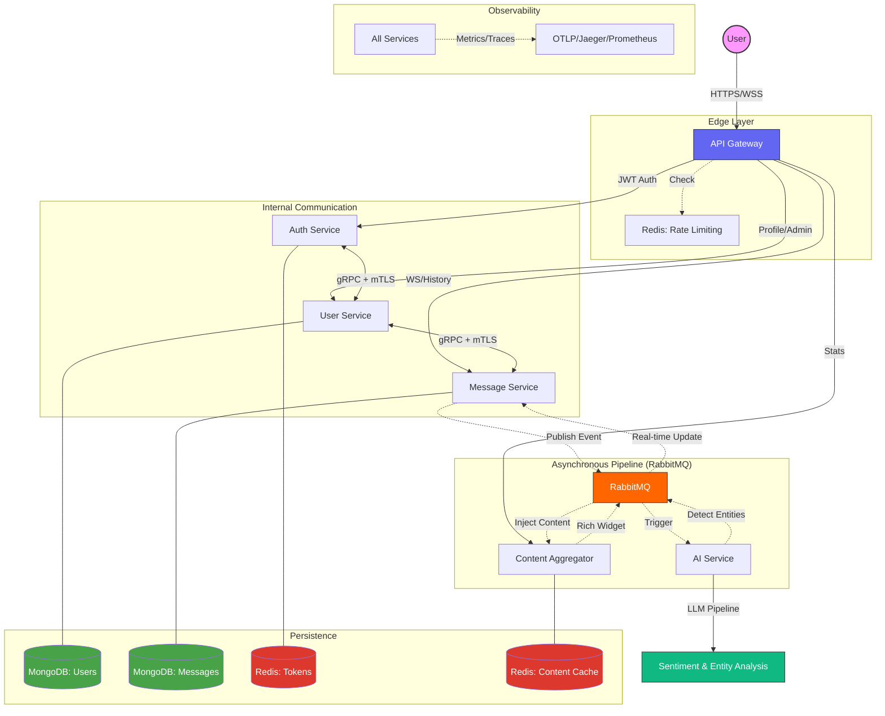

# AdaptaChat: Distributed Microservices Chat System (Labb 2)

A high-performance, resilient, and secure distributed chat system built with Spring Boot, Kotlin, and Kubernetes.

> **🚀 Getting Started**: For complete instructions on how to set up, build, and test this project locally in a Minikube cluster, please refer to the **[Setup & Demonstration Guide](SETUP.md)**.

## Architecture Overview



This project is designed to run on **Kubernetes (Minikube)**. To ensure your local code changes are reflected in the cluster, follow these procedures.

### Initial Setup
1. **Start Minikube**: `minikube start --cpus 4 --memory 8192`
2. **Apply Infrastructure**: `kubectl apply -f k8s/infrastructure/`
3. **Apply Secrets**: `kubectl apply -f k8s/infrastructure/secrets.yaml` (See secrets.example.yaml)
4. **Apply Services**: `kubectl apply -k k8s/overlays/local`

### The Development Loop (Restarting with Changes)
When you modify code in any service, follow these steps to update the running system:

1. **Build the Images**:
   ```powershell
   # Use the unified docker-compose to build all services with :latest tags
   docker-compose build
   ```

2. **The Golden Path (Optimized Workflow)**:
   Instead of loading images manually, run `minikube docker-env | Invoke-Expression` in your terminal. This points your Docker client to the Minikube daemon, making builds available instantly to Kubernetes.
   ```powershell
   minikube image load <service-name>:latest
   ```

3. **Restart Deployments**:
   Force Kubernetes to pull the newly loaded images:
   ```powershell
   kubectl rollout restart deployment <service-name>
   ```

### Networking
To access the frontend and API:
```powershell
# Port forward the frontend
kubectl port-forward service/frontend 3000:80
```
Then visit `http://localhost:3000`.

---

## Service Map

For a deep dive into the system's roles, data flows, and security rationale, see the [Detailed Architectural Overview](docs/overview.md).

- **API Gateway**: The hardened entry point. Implements security headers and Redis-backed rate limiting.        
- **Auth Service**: Manages user sessions, JWT issuance, and secure refresh token rotation.
- **User Service**: The "Identity Vault". Handles profiles, RBAC, and administrative overrides.
- **Message Service**: Manages real-time WebSockets and asynchronous persistence. Centralized logic for historical recovery.
- **AI Service**: Performs semantic sentiment analysis and entity extraction (Streamers, Games, Topics).        
- **Content Aggregator**: Injects rich media widgets based on semantic signals from the AI pipeline.
- **Feedback Service**: Gathers user UX/AI quality reports for continuous system refinement.
- **Common Modules**: Standardized `security`, `observability`, and `test` libraries shared across the monorepo.

---

## 🚀 Progress & Roadmap

- [x] **#01-11 Foundation**: Monorepo scaffolding, async pipeline (RabbitMQ), and K8s deployment.
- [x] **#12-13 Frontend Core**: React 19 SPA with Zustand state management and real-time engine.
- [x] **#16-26 Security Hardening**: Zero-Trust JWT, mTLS gRPC, PII Encryption, and Blind Indexing.
- [x] **#27-35 UI Adaptation**: "Lumina Fluid" style system with real-time AI-driven aesthetic shifts.
- [x] **#36-53 Stabilization**: Persistent partitioning, presence tracking, and bot ecosystem centralization.   
- [x] **#54-65 Feature Polish**: Global search indexing, mobile optimization, and read receipts.
- [x] **#66 Semantic UI**: Transitioned to LLM-based sentiment and 10s visual stabilization.
- [x] **#73-79 Governance**: Admin Command Center, role modulation, and identity persistence fixes.
- [x] **#080 Refinement**: Monorepo package standardization and dead code removal.
- [x] **#081 Personalization & Insights**: "Prism Aura" design system and personalization hub.
- [x] **#082 Admin Governance**: Administrative profile overrides and password reset protocols.
- [x] **#083 Semantic Signals**: Natural language entity extraction (Twitch/YouTube) with dynamic detection.    
- [x] **#084 Edge Security**: SecureHeaders and Redis-backed RequestRateLimiter at the Gateway.
- [x] **#085 Search Recovery**: Advanced historical search UI with sentiment and date filters.
- [x] **#086 DM Heuristics**: Robust sorted ID pattern for private frequency synchronization.

---

## 🛠 Technology Stack

- **Backend**: Spring Boot 3.4.3, Spring WebFlux (Reactive), Kotlin, Micrometer (Tracing/Metrics)
- **Frontend**: React 19, TypeScript, Vite, Zustand, Framer Motion, Vanilla CSS (**Prism Aura**)
- **Messaging**: RabbitMQ (Real-time Events), gRPC (mTLS), WebSockets
- **Persistence**: MongoDB (Reactive), Redis (Presence/Tokens/RateLimiting)
- **Observability**: OTLP/Jaeger, Prometheus, Actuator

---

## 🎯 Key Design Decisions

### Prism Aura Design System
AdaptaChat utilizes a modern, 3-layer Vanilla CSS architecture (`@layer tokens, base, components`) that provides deep, semantic control over theme variables without the overhead of utility frameworks. It supports GPU-accelerated transitions and multiple base aesthetics (Cyber, Nature, Minimal, Warm).

### Semantic Entity Extraction
The system has moved away from regex-based link detection. Instead, it utilizes the LLM pipeline to identify entities (like Twitch streamers) from natural language phrases (e.g., "watching wagamama"). This allows for a more "intelligent" and less fragile injection system.

### Zero-Trust Auth Hygiene
Sensitive tokens are kept strictly in-memory. User metadata (`displayName`) is persisted in `localStorage` for UX continuity, but re-authentication or server-driven refresh is required upon reload to maintain a high security posture.

### Standardized Common Modules
Shared logic is encapsulated in `com.example.labb_microservices.common.*` packages. This ensures that every service in the monorepo adheres to the same security, observability, and testing standards without duplication.     

---

## Author
- [Bamsemats](https://github.com/bamsemats)
